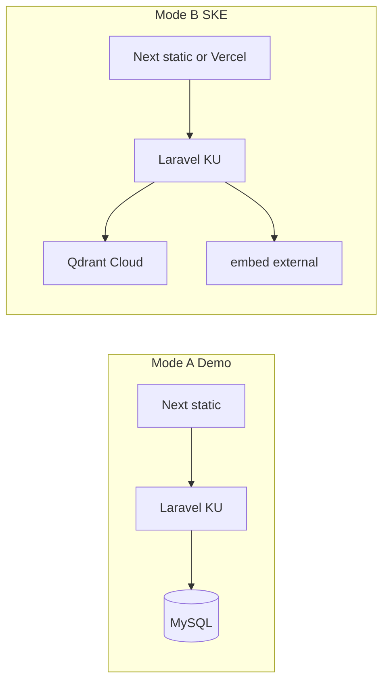

# KU VM Deploy — phumpanya.ku.ac.th

Deploy package: [`dist/ku-phumpanya-deploy.tgz`](dist/ku-phumpanya-deploy.tgz) (~27–54MB)

KU shared hosting constraints: **5 GB home quota**, SFTP port 22, MySQL on `127.0.0.1`, no Docker/daemon services on server.

## Deploy modes

| Mode | Where | Flags / services |
|------|-------|------------------|
| **A — Demo** | KU only (default) | `QDRANT_ENABLED=false`, `GEMINI_ENABLED=false`, `ELASTICSEARCH_ENABLED=false` — GraphRAG config fallback; Next SPA static under `html/public` |
| **B — SKE real** | KU Laravel + same-domain Next static (or Vercel) + Qdrant Cloud + external embed | Same host preferred: `FRONTEND_URL=APP_URL`; cloud keys on server; flip `*_ENABLED=true` |
| **C — Full stack** | Separate VPS (Huawei/AWS) | Out of scope here — use sala-panya-style Docker compose on your own VM |

Mode A is the default after first deploy. Mode B = ops change `.env` on server (no code fork).

**Same-domain Next (recommended):** no Node daemon on KU. Build Next with `output: 'export'` on Mac/CI, merge `out/` into Laravel `public/` (skip `admin/` so Filament keeps `/admin`). Apache serves SPA HTML; Laravel handles `/api`, `/auth`, `/sanctum`.



---

## Quick deploy (from your Mac)

```bash
cd ku-phumpanya

export KU_MYSQL_PASSWORD='your-mysql-password'
bash scripts/deploy-ku-vm.sh
```

Optional Mode A force on remote:

```bash
export KU_DEPLOY_MODE=demo
bash scripts/deploy-ku-vm.sh
```

---

## Auto redeploy (GitHub Actions)

Workflow: [`.github/workflows/deploy-ku.yml`](../.github/workflows/deploy-ku.yml)

Triggers: push to `main`, or manual **Run workflow**.

```
push main → php artisan test → build tarball → SCP → SSH ku-vm-remote-setup.sh → smoke curl
```

### GitHub secrets (required)

| Secret | Example | Purpose |
|--------|---------|---------|
| `KU_SSH_KEY` | private key PEM | SSH auth to KU server |
| `KU_MYSQL_PASSWORD` | from KU MySQL panel | remote `.env` DB password |

### GitHub secrets (optional)

| Secret / var | Default | Purpose |
|--------------|---------|---------|
| `KU_SSH_HOST` | `ppyku@phumpanya.ku.ac.th` | SSH user@host |
| `KU_DEPLOY_MODE` (repo variable) | unset | `demo` = force AI off; `ske` = leave Qdrant/Gemini env |

Setup SSH key once on server:

```bash
ssh-copy-id ppyku@phumpanya.ku.ac.th
# paste private key into GitHub secret KU_SSH_KEY
```

**Not used on KU:** GHCR, Docker pull, Elasticsearch/Qdrant/embed daemons on server.

Laravel-on-Vercel workflow ([`.github/workflows/deploy.yml`](../.github/workflows/deploy.yml)) is **manual only** (`workflow_dispatch`) so it does not compete with KU deploy.

---

## Manual deploy (FileZilla + SSH)

### Upload via SFTP (port 22)

Upload to `~/`:

- `dist/ku-phumpanya-deploy.tgz` (build locally first)
- `scripts/ku-vm-remote-setup.sh`

Build tarball locally (Laravel + Next static from `../KU-BCG`):

```bash
bash scripts/build-ku-deploy.sh dist/ku-phumpanya-deploy.tgz
# skip Next merge: KU_SKIP_NEXT_BUILD=1 bash scripts/build-ku-deploy.sh ...
```

`build-ku-deploy.sh` runs `NEXT_PUBLIC_API_URL=` (same-origin) then merges `KU-BCG/out/` → `public/` (excludes `admin/` and never overwrites `index.php`).

### SSH then run

```bash
ssh ppyku@phumpanya.ku.ac.th

export KU_MYSQL_PASSWORD='your-mysql-password'
bash ~/ku-vm-remote-setup.sh
```

---

## What the remote script does

1. PHP 8.3+ + extension check; `df -h` quota check
2. Extract app; **preserve existing `.env`** from prior deploy
3. Move app → `~/html/ku-phumpanya-app` (open_basedir)
4. Apply KU env baseline (`ELASTICSEARCH_ENABLED=false`; AI off unless Mode B keys present)
5. `migrate --force` + `db:seed --force`
6. Sync `public/*` → `~/html/public/` + KU `public-index.php` (includes Next SPA folders: `learn/`, `register/`, …)
7. `config:cache` + `route:clear` + `view:cache`

### `KU_DEPLOY_MODE`

| Value | Behavior |
|-------|----------|
| `demo` | Force `QDRANT_ENABLED=false`, `GEMINI_ENABLED=false` |
| `ske` | Leave Qdrant/Gemini env unchanged |
| unset | Disable AI only when cloud keys/URLs are absent |

---

## Mode B — enable SKE on KU

### Same-domain Next static (default)

Edit `~/html/ku-phumpanya-app/.env`:

```env
APP_URL=https://phumpanya.ku.ac.th
FRONTEND_URL=https://phumpanya.ku.ac.th
SANCTUM_STATEFUL_DOMAINS=phumpanya.ku.ac.th,www.phumpanya.ku.ac.th

QDRANT_ENABLED=true
QDRANT_HOST=https://xxxx.cloud.qdrant.io
QDRANT_API_KEY=...
QDRANT_EMBEDDING_URL=https://your-embed-service/embed

GEMINI_ENABLED=true
GEMINI_API_KEY=...
```

Then:

```bash
cd ~/html/ku-phumpanya-app
php artisan config:clear && php artisan config:cache
```

OAuth redirects to `/learn/` on the same host. Filament stays at `/admin` (Next `admin/` is not deployed).

### Optional: Vercel frontend instead

```env
FRONTEND_URL=https://your-next-app.vercel.app
SANCTUM_STATEFUL_DOMAINS=phumpanya.ku.ac.th,www.phumpanya.ku.ac.th,your-next-app.vercel.app
```

Rebuild the Vercel app with `NEXT_PUBLIC_API_URL=https://phumpanya.ku.ac.th` (must Redeploy after env change).

---

## Demo logins

| Email | Password |
|-------|----------|
| `student@phumpanya.test` | `password` |
| `admin@phumpanya.test` | `password` → `/admin` |

---

## Server layout

```
~/html/
  public/                  # Apache DOCUMENT_ROOT (web root จริง)
    index.php              # entry → ../ku-phumpanya-app
    .htaccess              # SPA rewrite + Laravel fallback
    learn/ register/ …     # Next static export (same-domain SPA)
    build/ css/ js/ ...
  ku-phumpanya-app/        # Laravel app (.env, vendor, artisan)
~/ku-phumpanya             # symlink → ku-phumpanya-app
```

**สำคัญ:** KU ใช้ `html/public/` เป็น document root — **ไม่ใช่** `html/` ตรงๆ  
phpinfo จะแสดง `DOCUMENT_ROOT=/home/web/.../html/public`

**ไม่รัน Node บน KU.** Build Next บน Mac/CI เท่านั้น.

Env template: [`.env.ku.production.example`](../.env.ku.production.example)

---

## Config highlights (Mode A default)

- `ELASTICSEARCH_ENABLED=false`
- `QDRANT_ENABLED=false`, `GEMINI_ENABLED=false`
- `DB_HOST=127.0.0.1` — MySQL on KU panel
- `SESSION_DRIVER=database`, `CACHE_STORE=database`, `QUEUE_CONNECTION=sync` — no Redis

---

## 500 Internal Server Error (Apache generic page)

**Root cause on KU:** `open_basedir` limits PHP to `~/html` — app must be at `~/html/ku-phumpanya-app`.

**Recovery:**

```bash
scp scripts/ku-vm-recover.sh ppyku@phumpanya.ku.ac.th:~/
ssh ppyku@phumpanya.ku.ac.th 'bash ~/ku-vm-recover.sh'
```

Do **not** paste multi-line shell blocks into an active SSH session — run the script only.

**Test order:**

1. https://phumpanya.ku.ac.th/hello.php → `PHP 8.4.x` + `autoload=OK`
2. https://phumpanya.ku.ac.th/ → Laravel home
3. https://phumpanya.ku.ac.th/up → health
4. `rm ~/html/public/hello.php` when done

```bash
tail -50 ~/html/ku-phumpanya-app/storage/logs/laravel.log
php ~/html/ku-phumpanya-app/artisan config:clear
```

| Issue | Fix |
|-------|-----|
| Still shows phpinfo | Fix **`~/html/public/index.php`** — not `~/html/index.php` (Apache docroot is `html/public`) |
| hello.php 500 | **Remove `~/html/ku-phumpanya-app/.htaccess`** — `Require all denied` breaks whole vhost on KU; also delete `._*` files |
| hello.php OK, / 500 | Check `storage/logs/laravel.log` |
| 404 routes | Ensure `~/html/public/.htaccess` exists |
| DB error | `DB_HOST=127.0.0.1`, verify MySQL password |
| Quota full | `df -h ~` — prune logs/backups under 5 GB |

---

## Security

- Rotate MySQL password after deploy if shared in chat
- Never commit `.env` to git
- KU may inspect account files per hosting policy — no secrets in web-visible paths
